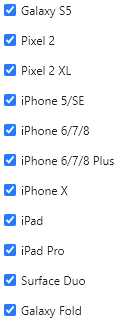

<a id="top"></a>

# Testing<!-- omit in toc -->

[Return to Readme](/README.md)

----

- [Code Validation](#code-validation)
  - [Functional Testing](#functional-testing)
- [Testing User Stories from User Experience (UX) Section](#testing-user-stories-from-user-experience-ux-section)
  - [First Time Visitor Story Testing](#first-time-visitor-story-testing)
  - [Returning Visitor Story Testing](#returning-visitor-story-testing)
  - [Site Owner Story Testing](#site-owner-story-testing)
- [Responsiveness](#responsiveness)
- [Lighthouse](#lighthouse)
- [Noteworthy Issues & Bugs Encountered in Development](#noteworthy-issues--bugs-encountered-in-development)

----

### Code Validation

The W3C Markup Validator, W3C CSS Validator, PEP8 Online and PyCharm were used to validate every page of the project to ensure there were no outstanding syntax errors in the project.  Results of those checks are documented in PDFs included in the project repository and can be accessed by following the links below.

- [W3C Markup Validator](https://validator.w3.org/nu/)
  - All pages validate without errors when validated from the deployed Heroku hosted, except for one error on the Register page which appears to be returned from the way in which WTForms renders a RadioField in a form.
  
  - Vaidation documentation:
    - [Index](validation/index-html.pdf)
    - [Login](validation/login-html.pdf)
    - [Register](validation/register-html.pdf)
    - [Explore](validation/explore-html.pdf)
    - [Add Photo](validation/upload-html.pdf)
    - [Photo](validation/photo-html.pdf)
    - [Profile](validation/profile-html.pdf)
    - [Edit Profile](validation/edit-profile-html.pdf)
  
  - Based on the HTML returned, it seems that this error is being returned due to the "for" label referring to a "ul" element with the corresponding ID, rather than an input field as it expects.  This is how WTForms / Jinja renders the HTML for a RadioField, and is not something I can configure.  The form and webpage behaves normally in functional testing and usage.
  
  - For reference, Jinja template code from the register.html file below, which produces the following HTML that returns this error:
    - Error message returned:
    - 
  
    ```jinja2
    {{ form.avatar.label(class_="form-control-label") }}
    {{ form.avatar(class_="form-control") }}
    ```

    ```html
    <label class="form-control-label" for="avatar">Choose Your Avatar Color</label>
      <ul class="form-control" id="avatar">
        <li>
          <input checked id="avatar-0" name="avatar" type="radio" value="1"> 
          <label for="avatar-0">Red</label>
        </li>
        <li>
          <input id="avatar-1" name="avatar" type="radio" value="2"> 
          <label for="avatar-1">Orange</label>
        </li>
        <li>
          <input id="avatar-2" name="avatar" type="radio" value="3"> 
          <label for="avatar-2">Teal</label>
        </li>
        <li>
          <input id="avatar-3" name="avatar" type="radio" value="4">
          <label for="avatar-3">Navy</label>
        </li>
      </ul>
    ```

- [W3C CSS Validator - Jigsaw](https://jigsaw.w3.org/css-validator/)
  - [Style.css Results](validation/MS3-CSS-Validation.pdf)
    - No warnings or errors returned when validating style.css content directly.
    - Note: multiple warnings are returned if validation is run on the deployed app due to dependencies such as Bootstrap.

- [JSHint](https://jshint.com/)
  - This project uses limited custom JavaScript, but does rely on external JS such as Masonry and ImagesLoaded to function correctly.  The internal JavaScript passed the JSHint linter with no errors, but did return two warnings as it was unable to identify the external packages referenced in the code (Masonry and ImagesLoaded) that are loaded outside of the code tested JS block.

- [PEP8 Online](http://pep8online.com/) - PEP8 Online is a web-based PEP8 code format compliance checker which was used to check each Python file in this app for PEP8 compliance.
  - Warnings returned for the app sub-package "__init__.py" files due to the need to import the routes package at the bottom of the file rather than the top, after the package blueprint is created.  Without this configuration the app will not work as it is not able to initialize any of the routes which depend upon the respective blueprints.  PyCharm does not produce any error or warning for this configuration.

- [PyCharm](https://www.jetbrains.com/pycharm/) - Pycharm Python IDE was used as an additional double-check on all Python code for PEP8 compliance after checking each file with PEP8 Online.
  
#### Functional Testing

- Below are descriptions of tests undertaken on the deployed project to ensure expected behaviors of functionality.

- Registration
  - PASSING: E-Mail Address Validation - Form correctly requires a valid email address to be entered in the email field.
  - PASSING: Password Match Validation - Form correctly requires passwords entered by the user to match.
  - PASSING: Empty Form Submission Validation - Form does not proceed with posting if required fields are blank.  Tested fields username, first name, last name, and password fields.  Avatar color is pre-selected by default and cannot be de-selected before submitting.
  - PASSING: Duplicate Email Cannot Register - Form correctly prevents a user from registering a new account using an email address that is already currently in the database.
  - PASSING: Default Avatar Selected - By default the form is populated with an avatar colour selected, which can be changed by the user but cannot be de-selected entirely, which is the intended behavior.
  - PASSING: Username Regex Validation - Usernames cannot contain spaces or special characters, only upper or lower case letters and numbers.  Confirmed multiple combinations of special characters and spaces in username field are returned as invalid by the form.

- Login
  - PASSING: Username Does Not Exist Validation - Form endpoint will catch mongoengine error response for a username that does not exist in the database and return a flash message to the user indicating the credentials are incorrect, but intentionally does not specify between the username or password being incorrect.  Correct login credentials are validated and result in a successful login.
  - PASSING: Incorrect Password Validation - Password validation functionality works correctly resulting in an incorrect login details flash message to the user.  This intentionally does not specify if the username or password is incorrect.

- Add Photo
  - OPEN: Description max length validation - Form validation from WTForms is not validating input length, despite being configured for validation in the form model.  Passing 'maxlength' to the necessary fields consistent with the validator length limits to ensure these field limits are adhered to.
  - OPEN: Title max length validation - Form validation from WTForms is not validating input length, despite being configured for validation in the form model.  Passing 'maxlength' to the necessary fields consistent with the validator length limits to ensure these field limits are adhered to.
  - PASSING: Title, Description, Photo file are required fields - Valid input is required for all fields on the photo upload form or the form will not allow the user to submit.
  - PASSING: File picker works on mobile devices - Tested on Apple iPhone 11 and iPad Pro 10.5 devices - user is able to take a new photo as well as select and upload from device photo library.

- Edit Photo
  - OPEN: Description max length validation - Form validation from WTForms is not validating input length, despite being configured for validation in the form model.  Passing 'maxlength' to the necessary fields consistent with the validator length limits to ensure these field limits are adhered to.
  - OPEN: Title max length validation - Form validation from WTForms is not validating input length, despite being configured for validation in the form model.  Passing 'maxlength' to the necessary fields consistent with the validator length limits to ensure these field limits are adhered to.
  - PASSING: Edit Title - Can edit title field of photo and changes are correctly saved and displayed on the photo immediately after editing.
  - PASSING: Edit Description - Can edit description field of photo and changes are correctly saved and displayed on the photo immediately after editing.

- Delete Photo
  - PASSING: Delete photo - Delete photo button removes photo from profile and feed as expected.
  - PASSING: Delete photo - Delete photo removes photo from Cloudinary library as expected.
  - PASSING: Delete photo - Delete photo removes photo entry from MongoDB photos collection as expected.

- Like / Unlike Photo
  - PASSING: Like photo updates correctly - Pressing 'like' button on another user's photo increases the like count by one and correctly changes the like button fill color to a solid blue background.
  - PASSING: Un-like photo updates correctly - Pressing 'like' button on another user's photo which has been liked by the current user correctly decreases the like count by one and changes the like button fill color back to the original off-white background.
  - PASSING: Like any user's photo - Pressing 'like' results in the expected behavior on any other user's photo.
  - PASSING: Like/Un-Like own photo - Pressing 'like' button on own photo results in expected behavior of adding one to the like count and changing the like button fill color to a solid blue background.

- Add Comment
  - OPEN: Comment max length validation - Currently known bug exists where form validation is not working as expected.  Max length validation is working on the back-end, preventing comments exceeding the specified maximum length from being submitted to the database, however no warning is displayed to the user on the UI.  When a comment exceeding the maximum length is submitted, the page reloads however no flash message or form validation message is displayed, and no entry is made to the database.
  - PASSING: Empty Comment form submission - Comment form validation for empty comment text field prevents an empty comment from being submitted.
  - PASSING: Add comment on another user's photo - Able to post a new comment on a photo uploaded by another user without any errors.
  - PASSING: Comment sorting on photo - Newly posted comment is displayed at the top of the list of comments, as intended by design.
  - PASSING: Comment displays correct details - Username, date added and comment text are displayed correctly for newly added comment.
  - PASSING: Comment displays correct buttons - Like, Edit and Delete buttons are displayed for a newly added comment posted and owned by the logged in user.
  - PASSING: Comment on own photo - Able to post a new comment on a photo uploaded by the same user posting the comment without any errors.

- Edit Comment
  - OPEN: Comment max length validation - Form validation from WTForms is not validating input length, despite being configured for validation in the form model.  Passing 'maxlength' to the necessary fields consistent with the validator length limits to ensure these field limits are adhered to.
  - PASSING: Edit button modal - Pressing the 'edit' button on a comment owned by the logged in user opens the edit comment modal, with the existing text populated in the edit field.
  - PASSING: Cancel edit button on modal - Pressing the 'cancel' button closes the modal with no changes applied to the comment.  Same behavior demonstrated for pressing 'X' button to close modal.
  - PASSING: Save changes to comment - Pressing 'save' closes the edit modal and displays the correct flash message to the user, updated text is displayed in the comment matching the text entered during editing.
  - PASSING: Updating comment on another user's photo - Update functions tested above performed without error on a comment added by the current user to another user's photo.
  - PASSING: Edited comment details correct - Edited comment displays the correct username, date added, and newly edited text value.
  - PASSING: Edited comment displays correct buttons - Edited comment displays the Like, Edit, and Delete buttons.
  - PASSING: Edit comment on own photo - Editing a comment posted on a photo uploaded by the same user works as expected and the comment displays the updated value immediately after saving changes.

- Delete Comment:
  - PASSING: Delete modal opens - Pressing the 'delete' button on a comment owned by the logged in user opens the delete comment modal, asking the user to confirm they wish to delete the comment.
  - PASSING: Cancel delete button on modal - Pressing the 'cancel' button closes the delete modal with no change made to the comment.  Same behavior demonstrated for pressing 'X' button to close modal.
  - PASSING: Delete comment on other's photo - Pressing the 'delete' button on the modal results in the correct flash message being displayed to the user and the comment being deleted.
  - PASSING: Delete comment on own photo - Pressing the 'delete' button on the modal results in the correct flash message being displayed to the user and the comment being deleted.

- Like / Unlike Comment:
  - PASSING: Liking comment updates correctly - Pressing 'like' on a comment correctly updates the like count by increasing by one and changes the like button fill color to a solid blue background.
  - PASSING: Un-liking comment updates correctly - Pressing 'like' on a comment that the current user has already liked updates the like count by decreasing by one and changes the like button fill color back to the original off-white background.
  - PASSING: Ability to like any comment - Pressing 'like' results in the expected behavior on any other user's comment.
  - PASSING: Can like/un-like own comments on own photo - Pressing 'like' results in the expected behavior on comments added to photos uploaded by the current user.

- Edit User Profile
  - OPEN: About Me description max length validation - Form validation from WTForms is not validating input length, despite being configured for validation in the form model.  Passing 'maxlength' to the necessary fields consistent with the validator length limits to ensure these field limits are adhered to.
  - PASSING: About Me displays correct text - After adding text to the About Me field, this correctly displays existing data.
  - PASSING: Avatar Color displays correct selection - Avatar will display the correct color based on setting captured at registration or after editing.
  - PASSING: Edit Profile Go Back button works - Clicking 'go back' button returns user to the profile page.
  - PASSING: Edit Profile Save Changes button updates profile - Clicking 'save changes' returns user to the profile page with updates applied.

- Explore Feed
  - PASSING: Like icon display - Like icon on photo feed correctly displays blue icon if photo has been liked by the current user, and gray icon if it has not been liked.
  - PASSING: Photo card details correct - Photo cards in feed correctly display photo, photo title and total likes count.
  - PASSING: Clicking photo opens correct details page - Clicking on a photo in the feed redirects the user to the correct photo's details page.
  - PASSING: Pagination working as expected - Explore feed is rendered with the correct number of photos on the page upon loading and displays page numbers at the bottom of the feed dynamically based on total photos on the platform.

- User Profile & Feed
  - PASSING: Add Photo button redirects correctly - Pressing the 'add photo' button redirects user to the upload photo page.
  - PASSING: Edit Profile button redirects correctly - Pressing the 'edit profile' button redirects the user to the correct profile edit page.
  - PASSING: Like Icon displays correctly - Like icon in the profile photo feed correctly displays a blue icon if the photo was liked by the photo owner, and a gray icon if it has not.
  - PASSING: Photo details correctly displayed on card - The photo, title, description, likes count and date added are all correctly displayed on the photo feed card.
  - PASSING: Clicking photo opens correct details page - Clicking on a photo in the profile photo feed redirects the user to the correct photo's details page.
  - PASSING: Pagination working as expected - Profile photo feed is rendered with the correct number of the user's photos on the page upon loading and displays page numbers at the bottom of the feed dynamically if the user has uploaded enough photos to require pagination.

### Testing User Stories from User Experience (UX) Section

#### First Time Visitor Story Testing

> I want to understand the service the website provides before registering.
- The initial landing page contains a large info card with a clear description of the goal of the site, and directs the user to the registration page.

> I want to create a new user account and be able to log in.
- The initial landing page contains a call-to-action button directing users to either the log in or registration pages depending on their needs.  In addition the navigation bar contains these same links.

> I want to easily interact with content posted by other users on the site by adding 'likes' or comments.
- After completing a very quick registration or log-in process, users are immediately greeted with the main content of the platform, the photo feed.  From here they can click into photos they may be interested in or continue through additional pages of photos.

> I want to easily add my own photos to the platform for other users to interact with.
- Once logged in users can access the photo upload form directly from the navigation bar, or from a button on their profile page.  Adding a photo requires only a title and brief description before uploading.

#### Returning Visitor Story Testing

> I want to easily log in to my account and access my profile.
- The site will keep a user session active for 12 hours if they do not log out explicitly, allowing them to immediately resume interacting with the platform if they return in this time.  Otherwise, if a session has expired they will be directed to the log in page immediately upon return.

> I want to be able to quickly access and explore the main photo feed content.
- The Explore feed is directly accessible from the menu bar from any location within the site once a user is logged in.

> I want to be able to manage the content I add to the platform - including editing or deleting my photos, comments and likes.
- Content that a user adds to the platform will display additional controls not visible on other user's photos and comments, giving them the ability to edit and/or delete photos or comments they no longer wish to keep online.  In addition any photo or comment a user 'likes' can be 'un-liked' by simply clicking the like button again.

#### Site Owner Story Testing

> I want to provide a streamlined registration and login experience.
- The user registration form contains only basic details about the user, and should easily fit on most screens without any scrolling required, allowing for fast and easy registration.  User's who register are then logged in automatically without any additional steps required.  For existing users, to log in they must simply enter their username and password and they will then be directed to the Explore feed.
  
> I want to provide a fun and interactive experience for the user.
- The Explore photo feed is organized by most liked photos first, then most recently uploaded, so there should be new content for users to view each time they visit the platform.  In addition, they can leave a 'like' or comment on any photo on the platform, providing many opportunities for engaging with content.

> I want to encourage the user to return back to the platform to see and interact with new content.
- The ability for users to keep adding new photos and getting feedback from other users on the platform creates incentive to check the platform regularly.  In addition, the Explore feed content should provide new content for a returning user to see based on the level of activity since they last visited.

> I want to allow users to manage their content - adding, editing and deleting as they desire.
- User's can easily add new photos or view all of their uploaded photos in their profile view, allowing them to quickly review the content they have posted.  Users can also click into any of these photos to edit attributes, edit or delete comments they have posted to a given photo, or delete the photo if they choose.

### Responsiveness

- All pages were tested for responsiveness and any visible bugs using Google Chrome developer tools to emulate the viewing size across all standard device sizes offered.  Media queries have been implemented in the CSS of the site to adjust various attributes as necessary to improve the viewing experience on small screen sizes, such as scaling social media icon sizes and adjusting button styling to remain easily usable.  In addition site rendering on very high resolutions (such as "4K" or 2160p) were checked to ensure consistent performance as expected.
  
  Device Screen Sizes Tested:

  

- In addition, all pages on the site were tested for correct behavior on a 27" desktop monitor, a 15.1" laptop monitor, an iPhone 11 and a 10.5" iPad Pro.  The pages scale and respond as expected for a normal user experience across these viewing sizes & devices.

### Lighthouse

- The Lighthouse tool within Chrome Developer tools was used to generate performance scores and identify areas for improvement in both mobile and desktop views of the page.  Lighthouse scoring was performed on the photo Explore page, as this is the most resource intensive page in the app.  Results of this scoring can be viewed via the links below:
  
  1. [Mobile Score & Summary](lighthouse/Explore-Mobile.pdf)

    
  
  2. [Desktop Score & Summary](lighthouse/Explore-Desktop.pdf)

    

- Please note that while efforts to correct some defects indicated in these results are due to issues found in external dependencies, such as MDBootstrap's CSS for example, or other faults that are beyond the scope of this project to remedy.

### Noteworthy Issues & Bugs Encountered in Development

- [Resolved] "None" response from WTForms process_data()
- An important component of the user experience for the site is pre-populating edit fields with the existing data, so that when a user clicks 'edit', they are able to see the values they have already entered.  This applies to photo descriptions and comments in particular.
  - When attempting to render the edit modal for these features, WTForms would not return any existing value, despite multiple approaches to apply the existing database values to the form fields.  
  - A solution was found using a WTForms method called process_data(), which is passed a data object as its only argument, that resulted in existing form data rendering in the form correctly.  This method was applied in the Jinja template code for the form fields - both a StringField input field a TextAreaField textarea.
  - When using this approach, for reasons still unknown, process_data() returned an additional value of " None ", which was injected in-between the label field and the input field below.  Hours of troubleshooting and discussion with my mentor did not result in a solution, so a work-around was crafted.
  - This problem was solved by setting up the necessary input fields in HTML directly, and setting the default values using Jinja to access the existing data values.

- [Resolved] Masonry layout rendering

- When implementing the Masonry layout, using the Masonry JS plugin compatible with MDB / Bootstrap v5, a serious rendering issue was encountered on initial loading of a photo page.
- Due to the Masonry layout being applied to the div structure before the image files were fully loaded, the image cards would render stacked to the top of the viewable area, and overlapping each other.  Refreshing the page would result in the correct layout rendering, as Masonry could correctly set the size attributes of the divs with the image files loaded.
- After extensive investigation, a solution was found using JavaScript to initialize Masonry after all page content was loaded, so that the layout will be applied correctly every time the page is viewed.
- This solution is credited to [this codepen example](https://codepen.io/desandro/pen/MwJoZQ) and was adapted for use in this project.

- [Open] "Back" button navigation after 'like'

- When a user views a photo then presses the 'like' button, to either add or remove a 'like', when they then press the back button in the browser, the page does not navigate back.  This behavior likely has to do with how the endpoint is being called to perform the like/un-like functions, which results in the current photo being re-rendered.  The database is being updated correctly in this instance but this is not an ideal user experience in its current state.

- [Open] Ongoing WTForms validation issues

- As mentioned previously in the testing section above, several forms are not validating correctly for some reason.  This seems to be isolated to value length limits specified in the form models that are not being enforced in the UI.  No data is being passed to the database that exceeds the character limits, but no form error message is being returned to the user to indicate they have violated a form requirement.  The current work-around solution to this is to pass the maxlength="x" parameter to the necessary form fields via their Jinja template code, which does work in preventing a user from exceeding the specified limit before submitting a form.  Additional investigation is needed to identify why these forms are behaving this way, while others such as Log In and Register are validating correctly.

[Return to the Top](#top)